# Investigating the Causal Effect of Extreme Heat on Respiratory Disease Mortality

**Authors:** Archy (Yaqi) Guo, Ruolin Wu, Linuode Ye  
**Instructor:** Takahiro Yabe  
**Date:** Sep. 2024 – Jan. 2025  
**Institution:** NYU CUSP

**Project Abstract:**
Applied GIS and statistics analysis to specify confounders. Used Instrumental Variables (IV) with albedo to address confounding variables, empirically proved its violation of the exclusion restriction. Employed Inverse Probability Weighting (IPW) with feature selection and polynomial regression to optimize the model; results proved a negative causal effect between extreme heat and respiratory mortality.

---

  
<i>👀 Reading Order: Left ➡️ Right, then Down ⬇️</i>

<table>
  <tr>
    <td width="50%" align="center">
      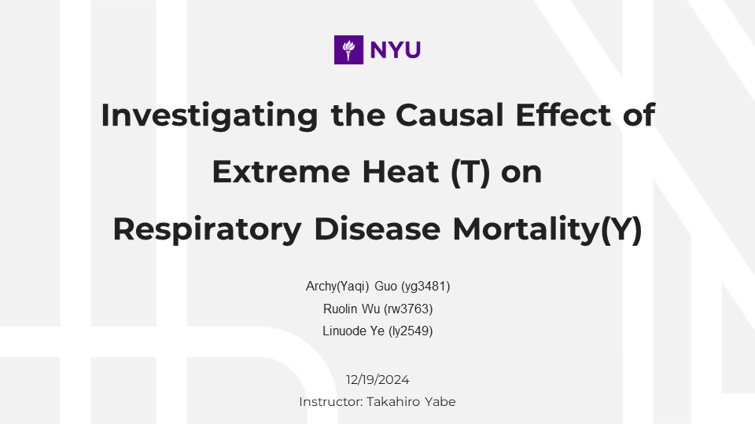
       Slide 1
    </td>
    <td width="50%" align="center">
      
       Slide 2
    </td>
  </tr>
  <tr>
    <td width="50%" align="center">
      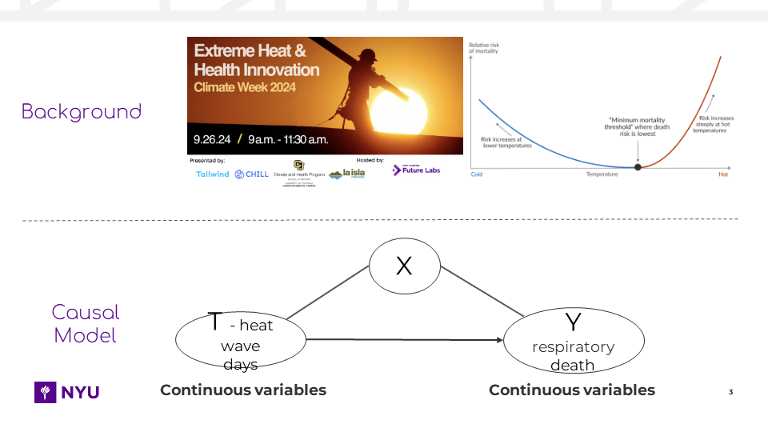
       Slide 3
    </td>
    <td width="50%" align="center">
      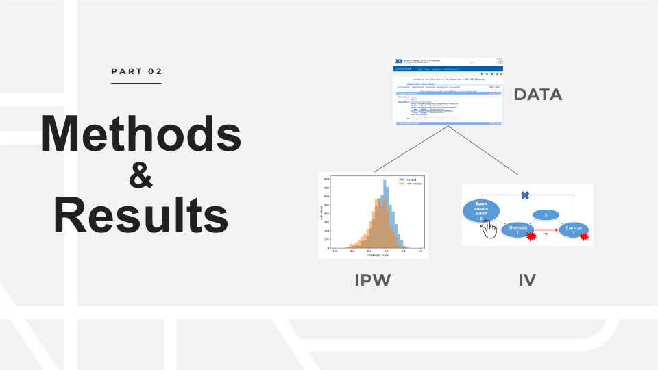
       Slide 4
    </td>
  </tr>
  <tr>
    <td width="50%" align="center">
      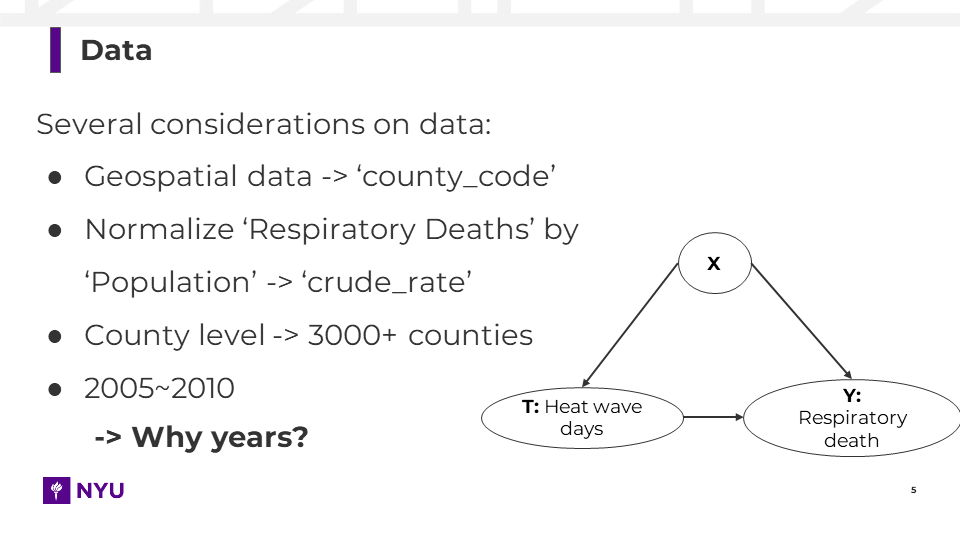
       Slide 5
    </td>
    <td width="50%" align="center">
      
       Slide 6
    </td>
  </tr>
  <tr>
    <td width="50%" align="center">
      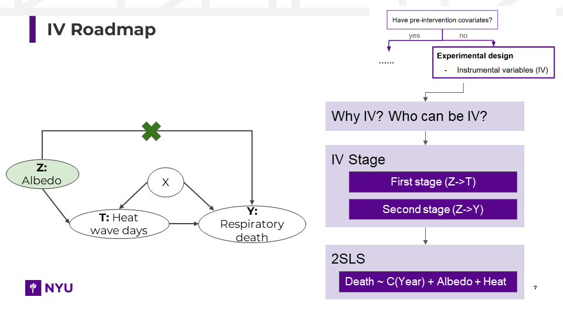
       Slide 7
    </td>
    <td width="50%" align="center">
      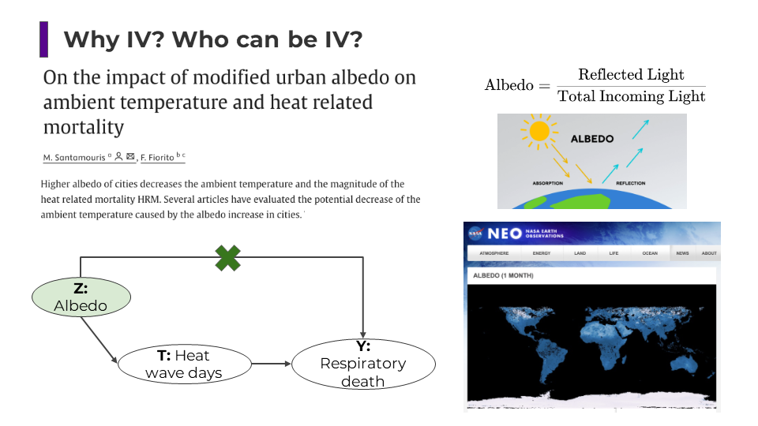
       Slide 8
    </td>
  </tr>
  <tr>
    <td width="50%" align="center">
      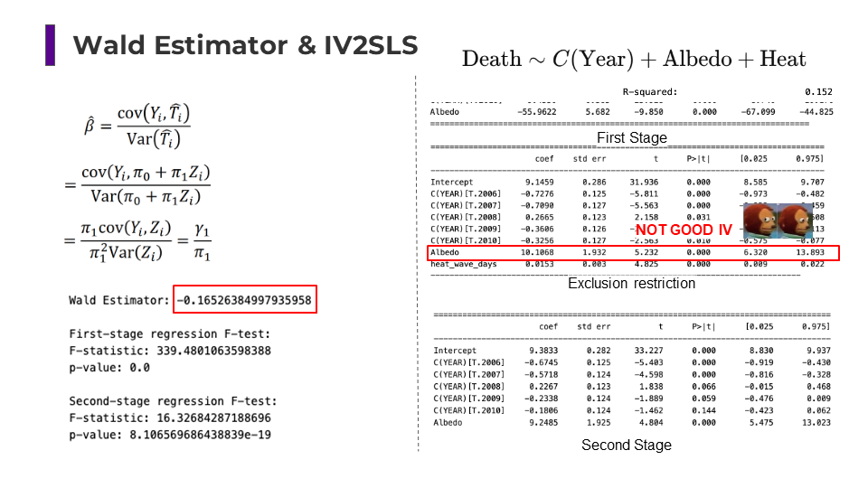
       Slide 9
    </td>
    <td width="50%" align="center">
      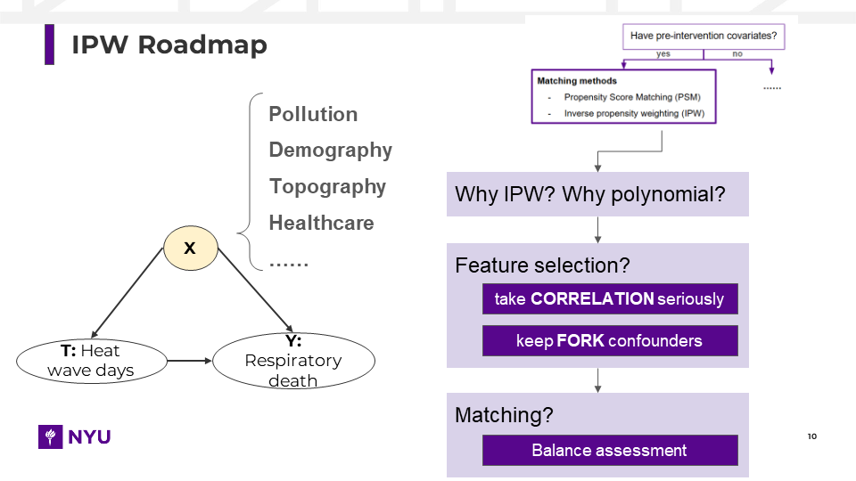
       Slide 10
    </td>
  </tr>
  <tr>
    <td width="50%" align="center">
      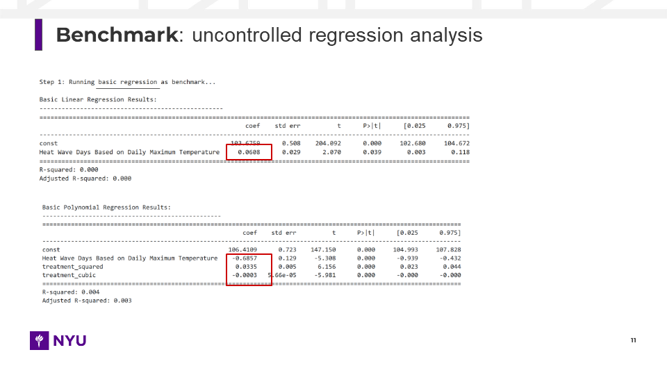
       Slide 11
    </td>
    <td width="50%" align="center">
      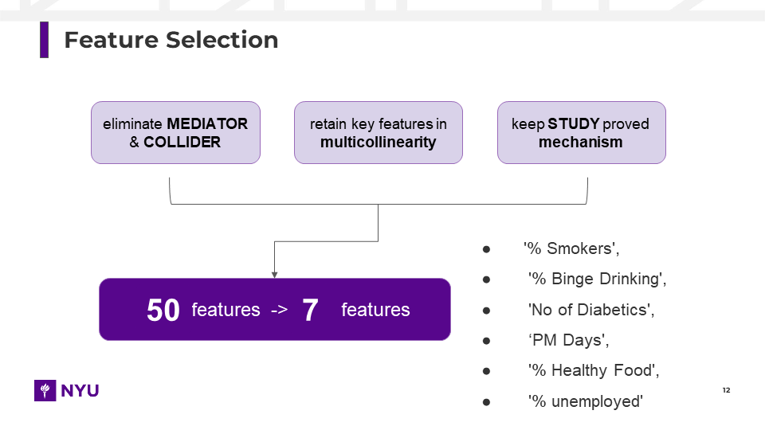
       Slide 12
    </td>
  </tr>
  <tr>
    <td width="50%" align="center">
      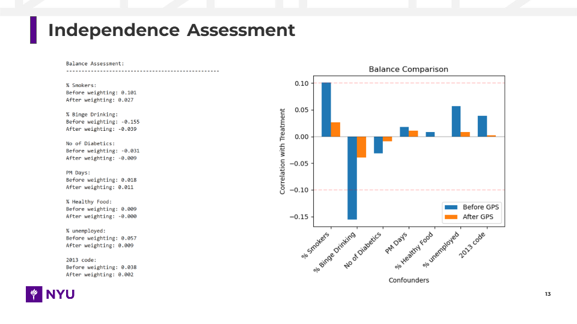
       Slide 13
    </td>
    <td width="50%" align="center">
      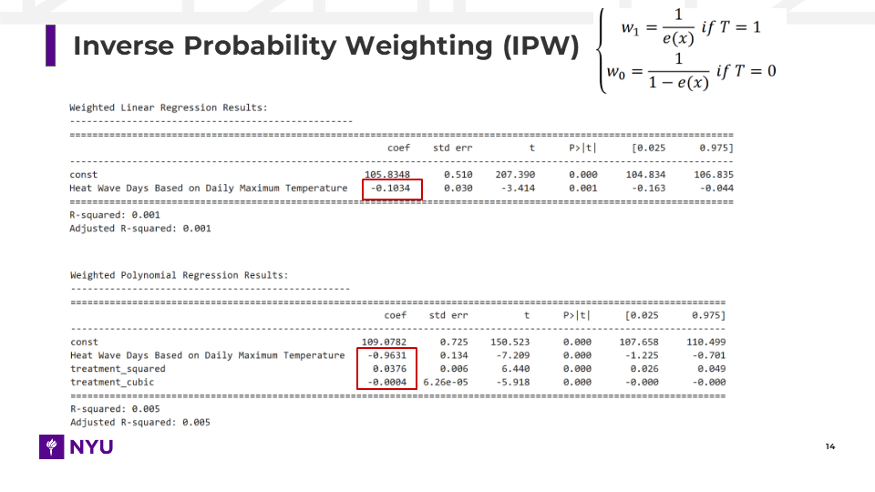
       Slide 14
    </td>
  </tr>
  <tr>
    <td width="50%" align="center">
      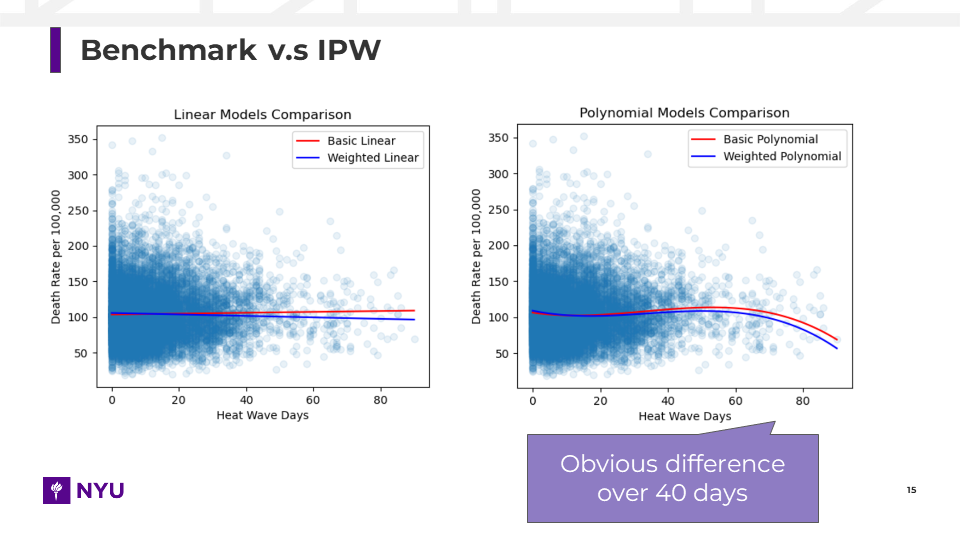
       Slide 15
    </td>
    <td width="50%" align="center">
      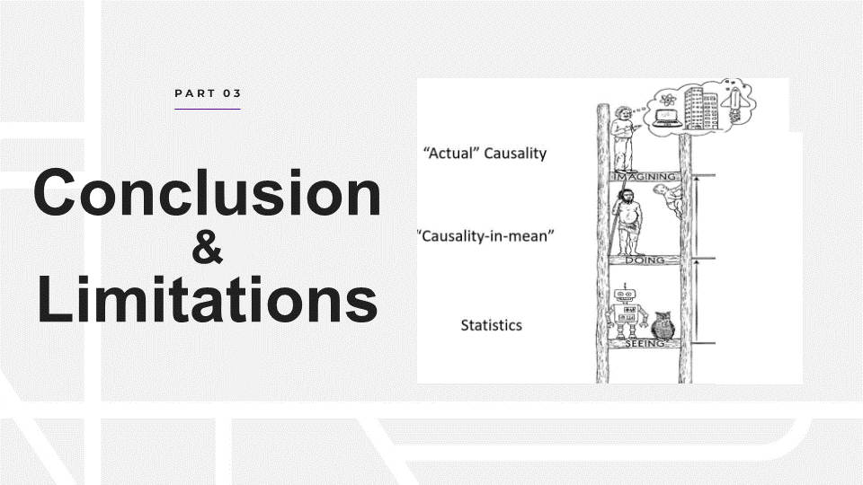
       Slide 16
    </td>
  </tr>
  <tr>
    <td width="50%" align="center">
      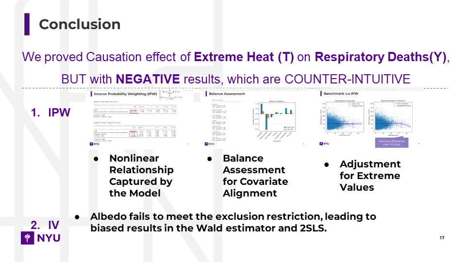
       Slide 17
    </td>
    <td width="50%" align="center">
      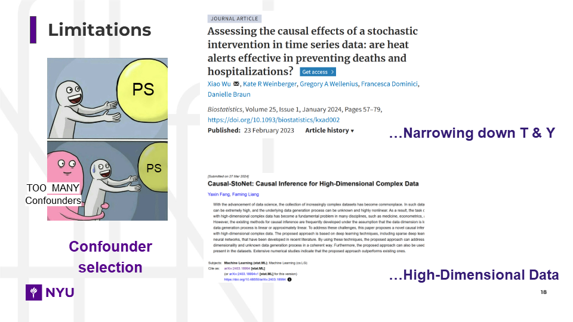
       Slide 18
    </td>
  </tr>
  <tr>
    <td width="50%" align="center">
      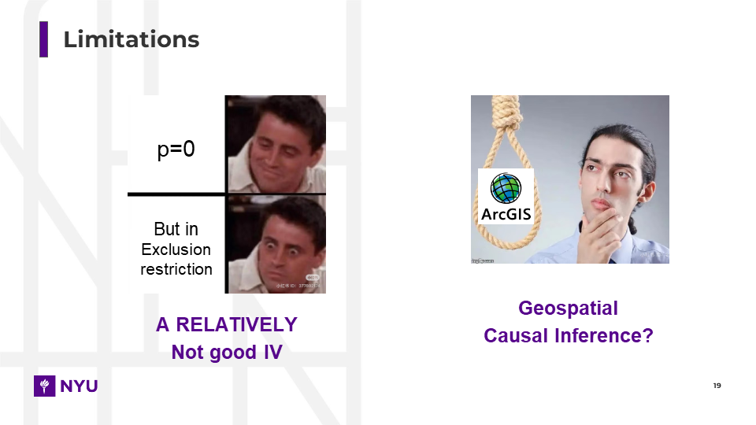
       Slide 19
    </td>
    <td width="50%" align="center">
      
       Slide 20
    </td>
  </tr>
</table>
